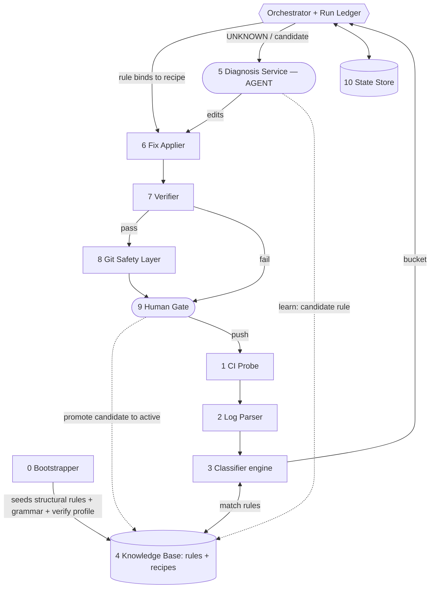
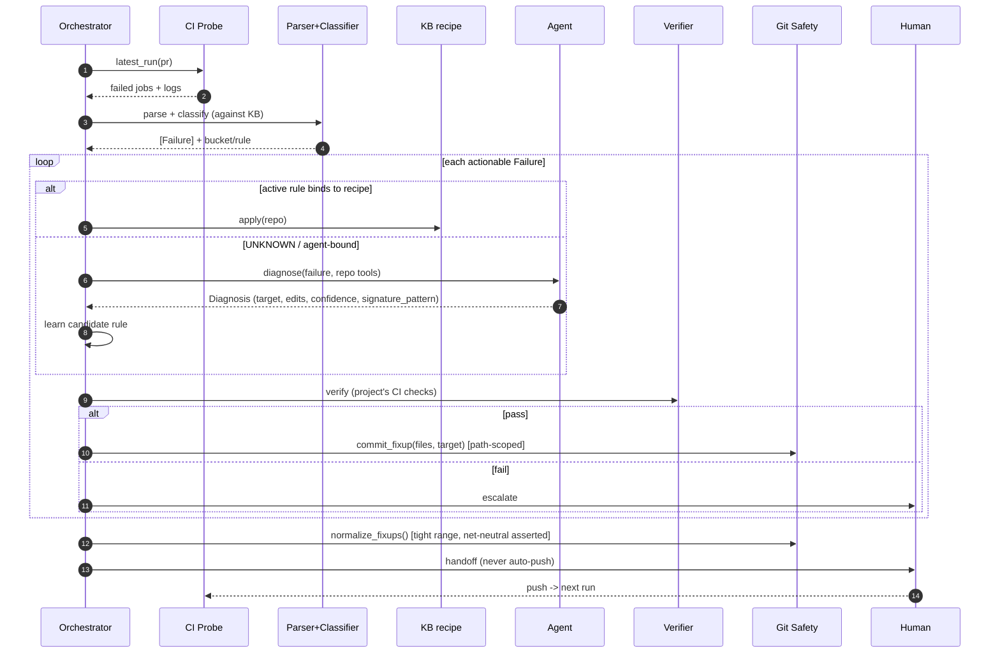
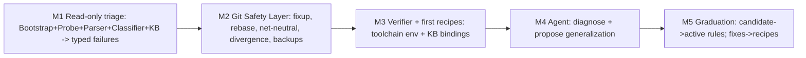

# CI Autofix Harness — Design

A hybrid **Program + Agent** for keeping OSS version-bump PRs green on an internal fork,
while preserving a clean, reviewable commit history.

> **Scope:** any **git** repo that is an internal fork tracking an OSS upstream, with CI
> config living in the repo. Nothing about a particular repo, build tool, or forge is
> compiled into the engine.
>
> **Provenance:** distilled and generalized from one large upstream version-bump PR on an
> internal fork. That project enters only as adapters + learned knowledge, never as engine
> code, so nothing below names it.
>
> This Markdown is the durable, canonical copy. A component-specs HTML used to sit beside
> it; it was deleted 2026-08-05, when ByteQuay's integration inverted the program/agent
> split and made the components it specified obsolete. Recover it from git history if you
> need the archaeology.

---

## 1. Problem & thesis

A version-bump PR is a long tail of cherry-picks from upstream onto the fork. Each pick is
fine in isolation; failures come from **the seams** — an upstream refactor whose fork-only
consumers weren't updated, a resource that must be regenerated, a semantic change that
ripples downstream. The job is to drive CI green **while preserving a clean
"one fixup per cherry-pick" history** so every commit stays independently reviewable —
the fixup sitting *next to* its pick, not folded into it, so the pick still matches
upstream verbatim.

On that PR, ~70% of the work was mechanical and repeatable (fetch logs, parse, classify,
regenerate, run style checks, create a path-scoped fixup, rebase it into place, prove the
rebase changed nothing but attribution). The other ~30% needed real judgment — *which*
cherry-pick caused this, *which* fork-only file it missed, whether a test expectation
legitimately changed, and which commit should *own* the fix.

**Thesis.** Build a **deterministic harness** that owns the loop, the toolchain, and every
git-history mutation — and treat the **agent as an advisory service** invoked only when no
learned rule matches. The agent *proposes* (a diagnosis + concrete edits); the harness
*applies, verifies, commits, and rebases* behind fixed guardrails. The harness ships
knowing nothing about any specific project: it **bootstraps** structural knowledge from the
project's own CI/build config, then **learns** every failure it meets — first occurrence is
explored by the agent and recorded, second is deterministic.

---

## 2. Operating invariants

Hard rules learned the expensive way in practice. The harness enforces these; they are never
the agent's discretion.

- **Fixup targets the semantic owner** — the cherry-pick whose subject matches *and* whose
  scope owns the change.
- **Always verify net-neutrality after a rebase** — `git diff OLD_TIP HEAD` must be empty
  when a rebase only re-attributes hunks. A non-empty diff means drift → abort and restore.
- **Fetch before comparing to origin** — a stale remote-tracking ref produced two wrong
  conclusions in one session.
- **Never `rebase -i master`** when master may have moved — use a tight internal range
  (`<target>^`) so no external commits can drift in.
- **Path-scope every commit** — `git commit -- <files>` so a human's staged WIP is never
  swept in.
- **Back up the tip before any history rewrite;** assert success by content, not exit code.
- **Regeneration is deterministic** — a 0-diff on files you didn't intend to touch is the
  proof the regen is correct and machine-independent.
- **Assume no failures — learn them.** No project-specific failure signatures are hardcoded.
- **Learned rules are candidate-until-confirmed** — a new classification never routes to an
  automated fix until confirmed (K hits or human approval), and every fix passes the Verifier.
- **Never push** — *policy, not engine (see §3: this is a Policy/config layer choice, set
  once per team). ByteQuay overrides it as of 2026-08-05: the harness pushes to the
  cherry-pick branch it owns so the CI loop closes unattended, and parks for review once
  green. It still never merges and never touches a branch it did not create.*

---

## 3. Portability model — five layers, zero hardcoded specifics

Every project-specific thing lives in one of five layers; the engine is generic.

| Layer | What it holds | Bound when |
|---|---|---|
| **Generic core** | orchestration loop, match engine, learning protocol, git-safety algorithms, record types | compiled in — never project-specific |
| **Adapters** | `ForgeAdapter` (GitHub Actions / GitLab / Buildkite…), `EcosystemPack` (Maven / Gradle / pytest / npm / cargo…), `AuthProvider` (CodeArtifact / OIDC / none) | selected at bootstrap by detection; pluggable |
| **Bootstrap-derived** | job topology, cloud/secret-gated jobs, module map, the `VerifyProfile` (commands read from CI), upstream-link convention | read from the project's own config each run |
| **Runtime-learned** | classification rules, recipe bindings, env deltas, flake registry — the KB | accretes from encounters |
| **Policy / config** | history model (fixup-per-pick vs squash), promotion thresholds, confidence θ, "never push" | team choice, set once |

### Generalization audit — every project-specific detail and where it went

| Looked project-specific | Reclassified as | Mechanism |
|---|---|---|
| `gh api`, GH-Actions endpoints, an "everything passed" aggregator job | Adapter | ForgeAdapter; aggregator derived from the workflow `needs:` graph, not named |
| Maven/surefire log grammar (`<<< FAILURE!`, `BUILD FAILURE`) | Adapter | EcosystemPack grammar; detected from build files |
| `mvn … <style>:check`, `-pl`, `-P errorprone`, `-Dtest` | Bootstrap-derived | VerifyProfile — actual commands read from CI |
| A pinned JDK, extra `--add-modules` flags, "the next JDK breaks regen" | Bootstrap + learned | env from `setup-*`/build config; local-only quirks learned as env deltas |
| Private-registry SSO auth | Adapter | AuthProvider; project declares which, secrets never inlined |
| The handful of concrete recipes it learned | Runtime-learned | KB rows composed from generic recipe *primitives*; none built-in |
| Narrow buckets like `PLAN_MISMATCH`, `COVERAGE_STUB` | Learned refinement | minimal universal bucket core; project-specific ones learned as sub-tags |
| The concrete signature table | Runtime-learned | example rows in *that project's* KB; illustrative only |
| `fixup!` + semantic-owner + net-neutral workflow | Policy | HistoryPolicy; a team may choose squash/separate-commits instead |
| `(cherry picked from …)` upstream linkage | Bootstrap-derived | upstream-link convention detected/configured; drives `oss_diff` |

---

## 4. Architecture & component roster



| # | Component | Owner | Responsibility |
|---|---|---|---|
| 0 | **Bootstrapper** | Program | Derive structural knowledge from the project's own CI/build config. |
| 1 | **CI Probe** | Program | Poll the run, list failed jobs, download logs (via ForgeAdapter). |
| 2 | **Log Parser** | Program | Raw build output → typed `Failure` records (grammar-pack driven). |
| 3 | **Classifier engine** | Program | Match a failure against the KB's learned rules; else `UNKNOWN`. |
| 4 | **Knowledge Base** | Program (learned) | Per-project rules + recipes; accumulated triage experience. |
| 5 | **Diagnosis Service** | **Agent** | Root-cause, author a fix, propose the rule generalization. |
| 6 | **Fix Applier** | Program | Apply a recipe's or agent's edits to the worktree. |
| 7 | **Verifier** | Program | Run the project's own CI checks (VerifyProfile) on a staged fix. |
| 8 | **Git Safety Layer** | Program | fixup, rebase, net-neutral & divergence checks, backups. |
| 9 | **Human Gate** | Human | Sign-off on ambiguity; promote candidate rules; the only actor that pushes. |
| 10 | **State Store** | Program | Idempotency, dedupe, run ledger; hosts the KB + graduation log. |

---

## 5. Data model

```python
class Bucket(Enum):
    # MINIMAL UNIVERSAL CORE — true of any build/test project
    STYLE     = "style"      # linter / formatter gate
    BUILD     = "build"      # compile / typecheck / package (may be a no-op for interpreted langs)
    TEST      = "test"       # a real assertion failure
    RESOURCE  = "resource"   # missing/stale generated artifact (fixtures, snapshots, plans)
    INFRA     = "infra"      # not locally reproducible (cloud/secret-gated/special hardware)
    FLAKE     = "flake"      # nondeterministic (races, OOM, quota)
    UNKNOWN   = "unknown"    # -> agent
    # Projects LEARN finer sub-buckets as tags on a rule, e.g. resource:"plan_mismatch",
    # test:"coverage_stub" — refinement is data in the KB, not new enum members.

@dataclass(frozen=True)
class Failure:
    run_id: str; job_name: str
    module: str                 # component/package (from the pack's module map)
    test_class: str | None; test_method: str | None
    signature: str              # normalized error line — dedupe key
    log_excerpt: str            # ~40 lines around the failure (for the agent)
    bucket: Bucket = Bucket.UNKNOWN

@dataclass(frozen=True)
class Diagnosis:                # produced by the AGENT
    root_cause: str; culprit_commit: str
    target_subject: str         # the fixup! target (semantic owner)
    edits: list["Edit"]
    signature_pattern: str      # the proposed generalization (learned rule matcher)
    bucket: Bucket; binding: str
    confidence: float; needs_human: bool = False; rationale: str = ""

@dataclass(frozen=True)
class Edit:      path: str; find: str; replace: str          # find = unique anchor
@dataclass(frozen=True)
class FixResult: files_changed: list[str]; target_subject: str; verify_cmds: list[str]; source: str

@dataclass
class Rule:      # a KB row — data, not code
    id: str; matcher: "Matcher"; scope: str | None
    bucket: Bucket; binding: str            # recipe_id | "agent" | "defer"
    status: str                             # "candidate" | "active" | "retired"
    origin: str                             # "bootstrap" | "agent" | "human"
    priority: int; evidence: list[str]; hits: int = 0
```

---

## 6. The orchestration loop



```python
CONF_THRESHOLD = 0.75
DEFER = {Bucket.INFRA, Bucket.FLAKE}

def run_loop(pr):
    while True:
        run = probe.latest_run(pr)
        if run.all_green(): return ledger.close(pr, "green")
        tip_before = git.head()
        applied = []
        for job in run.failed_jobs():
            for f in parse(probe.logs(job)):
                if ledger.seen(f.signature): continue          # idempotency
                bucket, rule = classify(f, kb)                 # against learned KB
                if bucket in DEFER: ledger.note(f); continue
                if rule and rule.binding not in ("agent",):    # active rule -> recipe
                    fix = applier.stage_recipe(kb.recipe(rule.binding), f)
                else:                                          # UNKNOWN / agent-bound -> explore + LEARN
                    dx = agent.diagnose(f, repo_tools())       # the only LLM call
                    if dx.needs_human or dx.confidence < CONF_THRESHOLD:
                        human.escalate(f, dx); continue
                    fix = applier.stage(dx.edits, dx.target_subject)
                    kb.learn_candidate(f, dx)
                if not verifier.run(fix.verify_cmds):
                    git.discard_worktree(); human.escalate(f, reason="verify failed"); continue
                git_safe.commit_fixup(fix.files_changed, fix.target_subject)
                ledger.record(f, fix); applied.append(fix)
        if applied: git_safe.normalize_fixups(tip_before)      # rebase + net-neutral assert
        human.handoff(ledger.summary(pr))                      # never auto-push
        run = probe.wait_for_next(pr, after=run.id)
```

Component-level detail (interfaces, worked code, edge cases, tests) lived in a
component-specs HTML deleted 2026-08-05 — see the note at the top of this file.

---

## 7. Program vs Agent — responsibility matrix

| Step | Owner | Implemented as |
|---|---|---|
| Bootstrap structural rules from CI/build config | Program | workflow + build-file readers |
| Poll CI, list failed jobs, fetch logs | Program | ForgeAdapter, pagination, caching |
| Parse logs → `Failure` | Program | grammar-pack regex + normalize + windowing |
| Classify → `Bucket` (match learned rules) | Program | generic engine over KB rules |
| Fix via a bound recipe (active rule) | Program | KB recipe (primitives) |
| **Root-cause a novel failure** | **Agent** | LLM + read-only repo/OSS tools |
| **Author the fix (edits)** | **Agent** | LLM → find/replace `Edit`s |
| **Choose the fixup target** | **Agent** (Program proposes candidates) | LLM picks semantic owner from `git log --grep` |
| **Propose the rule generalization** | **Agent** | LLM → `signature_pattern` + bucket + binding |
| Promote candidate rule → active | Human (or K-hit threshold) | KB promotion gate |
| Apply edits to worktree | Program | unique-anchor find/replace |
| Verify (project's CI checks) | Program | VerifyProfile executor |
| fixup / rebase / net-neutral / divergence | Program | Git Safety Layer |
| "Real bug vs flake?" edge calls | Agent → Human | agent judges; escalates if unsure |
| Trade-off decisions, sign-off, push | Human | Human Gate |

> **ByteQuay override (2026-08-05).** The rows above split judgment between the program and
> the agent. ByteQuay's integration gives the agent the whole fix — it edits the worktree,
> commits the fixup, positions it, validates it, pushes, and writes the knowledge-base
> entry — and the program keeps only the mechanical work: run the picks, probe, parse,
> annotate, persist, wait for CI to finalize, wake the agent. §8's boundaries ("no
> git-history mutation, no push, no write-shell") do not hold there, and the knowledge base
> is prose memory rather than the rule table of §5. See "The upstream sync run" in
> [`ci-autofix-design.md`](./ci-autofix-design.md).

---

## 8. The Agent contract

**Inputs the harness provides:** the `Failure`; read-only tools
(`read_file`, `grep`, `git_show`, `git_log`, `oss_diff`, `candidate_targets`); conventions
(invariants, target rule, style) as a system prompt + KB-derived hints; the strict output
schema + a few unrelated signatures for the generalization self-test; a tool budget + an
`escalate` affordance.

**Output (rejected if malformed):**

```json
{
  "root_cause": "one sentence",
  "culprit_commit": "sha | null",
  "target_subject": "exact subject line of an existing commit",
  "edits": [ { "path": "...", "find": "unique anchor", "replace": "..." } ],
  "signature_pattern": "regex generalizing this failure — the learned rule's matcher",
  "bucket": "the Bucket this signature should classify as",
  "binding": "recipe_id | \"agent\"",
  "verify_hint": ["style", "build", "test:Foo#bar"],
  "confidence": 0.0,
  "needs_human": false,
  "rationale": "why this fix & this target; evidence from tools"
}
```

**Boundaries — what the agent must NOT do:** no git-history mutation, no push, no
write-shell; no best-effort patches (a non-unique anchor or guessed target → `needs_human`);
no invented commit subjects; bounded tool budget, escalate rather than lower the bar.

---

## 9. Guardrails, encoded

| Invariant | Enforced in | Failure mode if skipped |
|---|---|---|
| Net-neutral after rebase | `normalize_fixups`, `move_hunk` | silent tree drift (40 files changed once) |
| Fetch before origin compare | `divergence` | wrong "origin lacks X" conclusion |
| Tight-range rebase (never `master`) | all rebases | pulls in unrelated commits |
| Path-scoped commit | `commit_fixup` | sweeps human's staged WIP |
| Backup before rewrite | Git Safety Layer | no recovery point |
| Unique-anchor edits | Fix Applier | wrong-location edit |
| Recipe/agent fix always verified | Orchestrator | commits a broken fix |
| Never push *(policy; ByteQuay pushes its own branch — see §2)* | everywhere | publishes unreviewed history |

---

## 10. Build order



- **M1 — highest ROI.** Bootstrap from CI config + typed triage; replaces manual log
  spelunking; stands up the empty KB. Pure functions, trivially testable.
- **M2 — highest risk-reduction.** Encodes the invariants that caused every near-miss.
- **M3 — covers the ~70%.** Verifier + first learned recipes handle recurring work, zero LLM.
- **M4–M5 — the ~30% tail + compounding.** Advisory agent for novel seams; each solved case
  graduates into the KB, so the agent is called less over time.

---

## 11. Appendix — one project's learned rules, as an example

Not built-in — a sketch of what a KB would look like after learning from one bump PR.
A different project's KB holds entirely different rows; only the engine is shared.

| Signature (normalized) | Bucket | Route |
|---|---|---|
| `resource <generated-fixture> not found` | RESOURCE | recipe: regen_fixtures |
| `resource <renamed-fixture> not found` | RESOURCE | recipe: rename_by_pattern |
| `expected/but was … <generated-fixture>` | RESOURCE:fixture_mismatch | recipe: regen_fixtures |
| `no handler registered for <scheme>://` | TEST | recipe: enable_optional_backend |
| linter/formatter violation | STYLE | recipe: style_format |
| `cannot find symbol / method …` | BUILD | agent (missed consumer) |
| `<coverage gate> failed` | TEST:coverage_stub | recipe: coverage_stub |
| assertion on optimizer/rewrite output | TEST | agent (semantics) |
| job is secret/cloud/special-hardware gated | INFRA | defer + flag |
| scale-dependent assertion · OOM · quota | FLAKE | defer + retry |
| — anything else — | UNKNOWN | agent |
